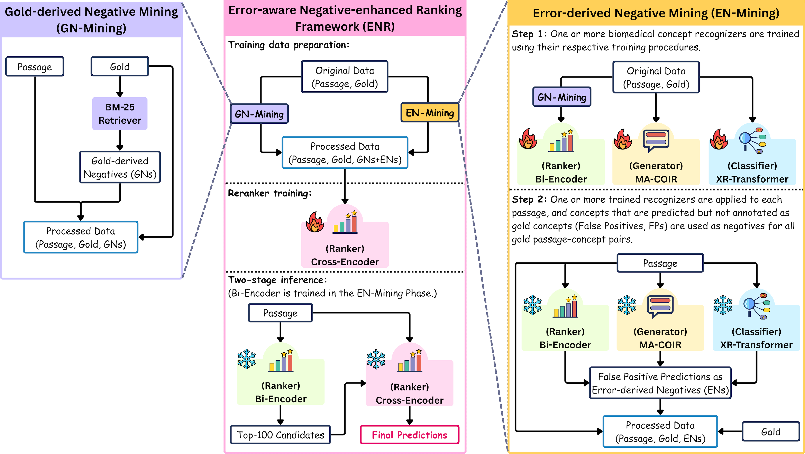

# Error-aware Negative-enhanced Ranking (ENR) Framework for Biomedical Concept Recognition

This repository contains all scripts of data preprocessing, model definition, model training, model prediction, 
model evaluation, and data post-processing about the Error-aware Negative-enhanced Ranking (ENR) Framework.

<p align="center">
  
  <br/>
  <em>Overview of the error-aware negative-enhanced ranking framework (ENR) for mention-agnostic biomedical concept recognition (MA-BCR).</em>
</p>
ENR combines gold-derived negatives (GN-mining) and error-derived negatives (EN-mining) to construct enhanced training data for a listwise cross-encoder ranker. EN-mining collects false positive predictions from heterogeneous one-stage biomedical concept recognizers.
Inference follows a standard bi-encoder→cross-encoder retrieve-rerank pipeline without additional overhead.


## Data preparation
Please refer to `docs/data.md` to prepare MM-GO and MM-HPO datasets for the experiments.

## Gold-derived Negative Mining (GN-Mining)
Corresponding details are provided in `docs/gn-mining.md`.

## Negative-derived Negative Mining (EN-Mining)
Corresponding details are provided in `docs/en-mining.md`.

## Re-ranker Training
Corresponding details are provided in `docs/cross-encoder.md`.

## Inference Notebook
We provide an offline inference pipeline notebook in `enr-recognizer-inference.ipynb`.
The best checkpoints used in our framework have been uploaded to HuggingFace, so you can test them with your own queries.

Models are:
```
Bi-encoder (retrieval) checkpoints:
  GO_BIENCODER = "Samantha633/enr-recognizer-biological-process-retriever"
  HPO_BIENCODER = "Samantha633/enr-recognizer-phenotypic-abnormality-retriever"

Cross-encoder (rerank) checkpoints:
  GO_CROSSENCODER = "Samantha633/enr-recognizer-biological-process-reranker"
  HPO_CROSSENCODER = "Samantha633/enr-recognizer-phenotypic-abnormality-reranker"
```
